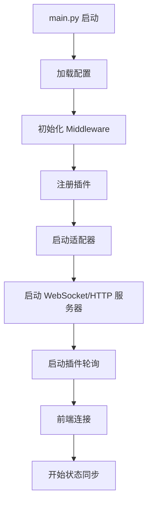

# Claude 桌面宠物 - 完整架构设计

**版本**: v3.0
**更新**: 2026-02-04

---

## 一、架构概览

```
┌─────────────────────────────────────────────────────────────────┐
│                        后端 - Middleware                          │
├─────────────────────────────────────────────────────────────────┤
│                                                                  │
│   ┌─────────────────────────────────────────────────────────┐  │
│   │                    Plugin Layer                          │  │
│   │                                                          │  │
│   │   ┌─────────────┐  ┌─────────────┐  ┌─────────────┐  │  │
│   │   │ Claude Plugin│  │OpenCode Plugin│  │ Custom Plugin│  │  │
│   │   └──────┬──────┘  └──────┬──────┘  └──────┬──────┘  │  │
│   │          │                 │                 │          │  │
│   └──────────┼─────────────────┼─────────────────┼──────────┘  │
│              └─────────────────┼─────────────────┘              │
│                                │                              │
│   ┌─────────────────────────────┼─────────────────────────────┐ │
│   │                    Middleware Core                      │ │
│   │                                                        │ │
│   │   ┌─────────────┐   ┌─────────────┐   ┌─────────────┐ │ │
│   │   │  State Pool │   │  Scheduler  │   │ Event Bus  │ │ │
│   │   │  (状态池)   │   │  (调度器)   │   │  (事件总线) │ │ │
│   │   └─────────────┘   └─────────────┘   └─────────────┘ │ │
│   │                                                        │ │
│   │   ┌─────────────────────────────────────────────────┐ │ │
│   │   │              Output Adapters                      │ │ │
│   │   │   WebSocket Adapter    HTTP Adapter   CLI Adapter│ │ │
│   │   └─────────────────────────────────────────────────┘ │ │
│   │                                                        │ │
│   └────────────────────────────┬────────────────────────────┘ │
│                                │                             │
│   ┌────────────────────────────┴────────────────────────────┐ │
│   │                    Communication Layer                   │ │
│   │                                                        │ │
│   │   WebSocket Server    HTTP Server    Stdout/Redis/MQ    │ │
│   │                                                        │ │
│   └─────────────────────────────────────────────────────────┘ │
│                                                                  │
└───────────────────────────────────────────────────────────────┘
                              │
                              │ JSON State Events
                              ▼
┌─────────────────────────────────────────────────────────────────┐
│                        前端 - Frontend                             │
├─────────────────────────────────────────────────────────────────┤
│                                                                  │
│   ┌─────────────────────────────────────────────────────────┐   │
│   │                    Core                                │   │
│   │   ┌─────────────┐   ┌─────────────┐   ┌─────────────┐│   │
│   │   │ State Manager│   │ Anim Engine │   │ Effect Sys ││   │
│   │   └─────────────┘   └─────────────┘   └─────────────┘│   │
│   │                                                        │   │
│   └────────────────────────┬───────────────────────────────┘   │
│                            │                                 │
│              ┌────────────┴────────────┐                    │
│              │                         │                     │
│              ▼                         ▼                     │
│   ┌─────────────────┐       ┌─────────────────┐            │
│   │   GIF Display   │       │   CSS Effects  │            │
│   │   (动画显示)     │       │   (视觉效果)   │            │
│   └─────────────────┘       └─────────────────┘            │
│                                                                │
│   ┌─────────────────────────────────────────────────────────┐ │
│   │                  View Layer                            │ │
│   │                                                         │ │
│   │   ┌─────────────┐  ┌─────────────┐  ┌─────────────┐│ │
│   │   │ Pet Window  │  │ Tray Icon   │  │ Console UI  ││ │
│   │   └─────────────┘  └─────────────┘  └─────────────┘│ │
│   │                                                         │ │
│   └─────────────────────────────────────────────────────────┘ │
│                                                                  │
└─────────────────────────────────────────────────────────────────┘
```

---

## 二、核心组件

### 2.1 插件接口（Plugin Interface）

```python
from abc import ABC, abstractmethod
from typing import Dict, Optional, Any
from dataclasses import dataclass, field
from enum import Enum
from datetime import datetime
import time


class Status(Enum):
    """统一状态枚举"""
    UNKNOWN = "unknown"
    IDLE = "idle"
    RUNNING = "running"
    WORKING = "working"
    THINKING = "thinking"
    EXECUTING = "executing"
    ERROR = "error"
    STOPPED = "stopped"


@dataclass
class StateEvent:
    """状态事件"""
    plugin_name: str
    status: Status
    confidence: float  # 0.0 - 1.0
    details: Dict[str, Any] = field(default_factory=dict)
    timestamp: float = field(default_factory=time.time)


class Plugin(ABC):
    """插件基类"""
    
    # 元信息
    name: str = "base_plugin"
    version: str = "1.0.0"
    description: str = ""
    author: str = ""
    
    def __init__(self, config: Dict = None):
        self.config = config or {}
        self.enabled = True
        self.running = False
        self.middleware = None  # 引用中间件
    
    # ========== 必须实现 ==========
    
    @abstractmethod
    def check_available(self) -> bool:
        """检查目标是否可用"""
        pass
    
    @abstractmethod
    def detect(self) -> StateEvent:
        """检测状态，返回状态事件"""
        pass
    
    # ========== 可选实现 ==========
    
    def initialize(self, middleware):
        """初始化，接收中间件引用"""
        self.middleware = middleware
    
    def start(self):
        """插件启动"""
        self.running = True
    
    def stop(self):
        """插件停止"""
        self.running = False
    
    def on_event(self, event: StateEvent):
        """接收事件（可选）"""
        pass
    
    # ========== 工具方法 ==========
    
    def is_enabled(self) -> bool:
        return self.enabled
    
    def set_enabled(self, enabled: bool):
        self.enabled = enabled
    
    def publish(self, event: StateEvent):
        """发布事件到中间件"""
        if self.middleware:
            self.middleware.publish(event)
```

---

### 2.2 中间件核心（Middleware Core）

```python
class Middleware:
    """
    状态检测中间件核心
    
    职责：
    1. 管理插件（注册、加载、调度）
    2. 聚合状态事件
    3. 输出到各种适配器
    """
    
    def __init__(self, config: Dict = None):
        self.config = config or {}
        
        # 插件管理
        self.plugins: Dict[str, Plugin] = {}
        
        # 状态池
        self.state_pool: Dict[str, StateEvent] = {}
        
        # 事件总线
        self.event_handlers: Dict[str, list] = {}
        
        # 输出适配器
        self.output_adapters: list = []
        
        # 调度器
        self.scheduler = None  # background scheduler
        
        # 运行状态
        self.running = False
    
    # ========== 插件管理 ==========
    
    def register(self, plugin: Plugin, config: Dict = None):
        """注册插件"""
        self.plugins[plugin.name] = plugin
        plugin.initialize(self)
        print(f"[Middleware] 注册插件: {plugin.name} v{plugin.version}")
    
    def unregister(self, name: str):
        """注销插件"""
        if name in self.plugins:
            self.plugins[name].stop()
            del self.plugins[name]
    
    def get_plugin(self, name: str) -> Optional[Plugin]:
        """获取插件"""
        return self.plugins.get(name)
    
    # ========== 事件处理 ==========
    
    def publish(self, event: StateEvent):
        """
        发布状态事件
        
        1. 更新状态池
        2. 触发事件处理器
        3. 推送到输出适配器
        """
        # 更新状态池
        self.state_pool[event.plugin_name] = event
        
        # 触发事件处理器
        self._dispatch(event)
        
        # 推送到输出适配器
        for adapter in self.output_adapters:
            try:
                adapter.send(event)
            except Exception as e:
                print(f"[Middleware] Adapter error: {e}")
    
    def subscribe(self, event_type: str, handler: Callable):
        """订阅事件"""
        if event_type not in self.event_handlers:
            self.event_handlers[event_type] = []
        self.event_handlers[event_type].append(handler)
    
    def _dispatch(self, event: StateEvent):
        """分发事件"""
        handlers = self.event_handlers.get(event.status.value, [])
        handlers.extend(self.event_handlers.get("*", []))  # 通配符
        
        for handler in handlers:
            try:
                handler(event)
            except Exception as e:
                print(f"[Middleware] Handler error: {e}")
    
    # ========== 适配器管理 ==========
    
    def add_adapter(self, adapter):
        """添加输出适配器"""
        self.output_adapters.append(adapter)
    
    def remove_adapter(self, adapter):
        """移除输出适配器"""
        if adapter in self.output_adapters:
            self.output_adapters.remove(adapter)
    
    # ========== 生命周期 ==========
    
    def start(self):
        """启动中间件"""
        self.running = True
        
        # 启动所有插件
        for name, plugin in self.plugins.items():
            if plugin.is_enabled():
                plugin.start()
        
        # 启动调度器
        self._start_scheduler()
        
        print(f"[Middleware] 已启动，{len(self.plugins)} 个插件")
    
    def stop(self):
        """停止中间件"""
        self.running = False
        
        # 停止所有插件
        for name, plugin in self.plugins.items():
            plugin.stop()
        
        # 停止调度器
        self._stop_scheduler()
        
        print("[Middleware] 已停止")
    
    def _start_scheduler(self):
        """启动调度器"""
        import threading
        self.scheduler = threading.Thread(target=self._run_scheduler, daemon=True)
        self.scheduler.start()
    
    def _run_scheduler(self):
        """运行调度循环"""
        import time
        
        while self.running:
            # 轮询所有插件
            for name, plugin in self.plugins.items():
                if plugin.is_enabled() and plugin.check_available():
                    try:
                        event = plugin.detect()
                        self.publish(event)
                    except Exception as e:
                        print(f"[Middleware] Plugin {name} error: {e}")
            
            # 等待
            interval = self.config.get('poll_interval', 2.0)
            time.sleep(interval)
    
    def _stop_scheduler(self):
        """停止调度器"""
        if self.scheduler:
            self.scheduler.join(timeout=1.0)
    
    # ========== 状态查询 ==========
    
    def get_all_states(self) -> Dict[str, StateEvent]:
        """获取所有插件状态"""
        return self.state_pool.copy()
    
    def get_fused_state(self) -> StateEvent:
        """
        获取融合状态
        
        策略：
        1. 按优先级选择
        2. 加权投票
        3. 时间衰减
        """
        states = list(self.state_pool.values())
        
        if not states:
            return StateEvent(
                plugin_name="middleware",
                status=Status.UNKNOWN,
                confidence=0.0
            )
        
        # 优先级投票
        priority = {
            Status.ERROR: 100,
            Status.EXECUTING: 80,
            Status.WORKING: 70,
            Status.THINKING: 60,
            Status.RUNNING: 40,
            Status.IDLE: 20,
            Status.STOPPED: 0,
        }
        
        # 统计状态
        status_votes = {}
        for event in states:
            status = event.status
            weight = event.confidence * priority.get(status, 0)
            
            if status not in status_votes:
                status_votes[status] = 0.0
            status_votes[status] += weight
        
        # 选择最高
        best_status = max(status_votes.keys(), 
                         key=lambda s: (status_votes[s], priority.get(s, 0)))
        
        # 计算置信度
        total = sum(status_votes.values())
        confidence = status_votes[best_status] / total if total > 0 else 0
        
        return StateEvent(
            plugin_name="fusion",
            status=best_status,
            confidence=confidence,
            details={'votes': status_votes}
        )
```

---

### 2.3 输出适配器（Output Adapters）

```python
class OutputAdapter(ABC):
    """输出适配器基类"""
    
    @abstractmethod
    def send(self, event: StateEvent):
        """发送状态事件"""
        pass


class WebSocketAdapter(OutputAdapter):
    """WebSocket 输出适配器"""
    
    def __init__(self, host: str = "127.0.0.1", port: int = 8765):
        self.host = host
        self.port = port
        self.connections = []
        self.server = None
    
    def start(self):
        """启动 WebSocket 服务器"""
        import asyncio
        import websockets
        
        async def handler(websocket):
            self.connections.append(websocket)
            try:
                await websocket.send("connected")
                async for message in websocket:
                    pass
            finally:
                if websocket in self.connections:
                    self.connections.remove(websocket)
        
        self.server = websockets.serve(handler, self.host, self.port)
        print(f"[WebSocket] Server started at ws://{self.host}:{self.port}")
    
    def send(self, event: StateEvent):
        """广播状态事件"""
        import json
        data = {
            'plugin': event.plugin_name,
            'status': event.status.value,
            'confidence': event.confidence,
            'details': event.details,
            'timestamp': event.timestamp,
        }
        
        message = json.dumps(data)
        
        # 广播到所有连接
        disconnected = []
        for ws in self.connections:
            try:
                asyncio.run(ws.send(message))
            except Exception as e:
                disconnected.append(ws)
        
        # 清理断开的连接
        for ws in disconnected:
            self.connections.remove(ws)


class HTTPAdapter(OutputAdapter):
    """HTTP REST 输出适配器"""
    
    def __init__(self, host: str = "127.0.0.1", port: int = 8080):
        self.host = host
        self.port = port
        self.app = None
    
    def start(self):
        """启动 HTTP 服务器"""
        from flask import Flask, jsonify
        
        self.app = Flask(__name__)
        
        @self.app.route('/api/state')
        def get_state():
            from middleware import get_middleware
            mw = get_middleware()
            return jsonify(mw.get_fused_state().__dict__)
        
        @self.app.route('/api/states')
        def get_all_states():
            from middleware import get_middleware
            mw = get_middleware()
            return jsonify({
                name: event.__dict__ 
                for name, event in mw.get_all_states().items()
            })
        
        self.app.run(host=self.host, port=self.port, threaded=True)
        print(f"[HTTP] Server started at http://{self.host}:{self.port}")


class StdoutAdapter(OutputAdapter):
    """标准输出适配器（调试用）"""
    
    def send(self, event: StateEvent):
        """打印状态"""
        print(f"[{event.plugin_name:15}] {event.status.value:10} ({event.confidence:.0%})")


class RedisAdapter(OutputAdapter):
    """Redis 发布适配器"""
    
    def __init__(self, channel: str = "claude:status"):
        import redis
        self.client = redis.Redis()
        self.channel = channel
    
    def send(self, event: StateEvent):
        """发布到 Redis"""
        import json
        self.client.publish(self.channel, json.dumps(event.__dict__))
```

---

### 2.4 前端核心（Frontend Core）

```python
class Frontend:
    """前端核心"""
    
    def __init__(self, config: Dict = None):
        self.config = config or {}
        self.state_manager = StateManager()
        self.animation_engine = AnimationEngine()
        self.effect_system = EffectSystem()
    
    def connect(self, adapter_type: str = "websocket", **kwargs):
        """连接到中间件"""
        if adapter_type == "websocket":
            self.adapter = WebSocketClient(kwargs.get('url', 'ws://127.0.0.1:8765'))
        elif adapter_type == "http":
            self.adapter = HTTPClient(kwargs.get('url', 'http://127.0.0.1:8080'))
        
        self.adapter.connect(self.on_state_received)
    
    def on_state_received(self, event: StateEvent):
        """接收状态事件"""
        # 更新状态管理器
        self.state_manager.update(event)
        
        # 触发动画
        self.animation_engine.play(event.status)
        
        # 触发效果
        self.effect_system.trigger(event.status)
    
    def run(self):
        """运行前端"""
        self.animation_engine.start()
        self.adapter.start_listening()


class StateManager:
    """状态管理器"""
    
    def __init__(self):
        self.current_state = Status.UNKNOWN
        self.state_history = []
        self.confidence = 0.0
    
    def update(self, event: StateEvent):
        """更新状态"""
        self.current_state = event.status
        self.confidence = event.confidence
        
        # 记录历史
        self.state_history.append({
            'status': event.status,
            'confidence': event.confidence,
            'timestamp': event.timestamp
        })
        
        # 保持最近 100 条
        if len(self.state_history) > 100:
            self.state_history = self.state_history[-100:]


class AnimationEngine:
    """动画引擎"""
    
    def __init__(self):
        self.current_animation = None
        self.animations: Dict[Status, str] = {
            Status.IDLE: "idle.gif",
            Status.RUNNING: "running.gif",
            Status.WORKING: "working.gif",
            Status.THINKING: "thinking.gif",
            Status.EXECUTING: "executing.gif",
            Status.ERROR: "error.gif",
            Status.STOPPED: "stopped.gif",
        }
    
    def play(self, status: Status):
        """播放动画"""
        gif_path = self.animations.get(status, "default.gif")
        self._load_and_play(gif_path)
    
    def _load_and_play(self, path: str):
        """加载并播放 GIF"""
        # 实现 GIF 加载和播放
        pass


class EffectSystem:
    """效果系统"""
    
    def __init__(self):
        self.effects: Dict[Status, list] = {
            Status.IDLE: [self.fade_out],
            Status.WORKING: [self.pulse],
            Status.ERROR: [self.shake, self.flash_red],
        }
    
    def trigger(self, status: Status):
        """触发效果"""
        effects = self.effects.get(status, [])
        for effect in effects:
            effect()
    
    def fade_out(self):
        """淡出效果"""
        pass
    
    def pulse(self):
        """脉冲效果"""
        pass
    
    def shake(self):
        """摇晃效果"""
        pass
    
    def flash_red(self):
        """红色闪烁"""
        pass
```

---

## 三、通信协议

### 3.1 WebSocket 消息格式

```json
{
  "plugin": "claude_code",
  "status": "thinking",
  "confidence": 0.85,
  "details": {
    "cpu": 12.5,
    "memory": 256.0
  },
  "timestamp": 1700000000.123
}
```

### 3.2 HTTP REST API

| 方法 | 端点 | 描述 |
|------|------|------|
| GET | /api/state | 获取融合状态 |
| GET | /api/states | 获取所有插件状态 |
| GET | /api/plugins | 获取插件列表 |
| POST | /api/plugins/{name}/enable | 启用插件 |
| POST | /api/plugins/{name}/disable | 禁用插件 |

---

## 四、目录结构

```
claude_pet/
├── src/
│   ├── core/
│   │   ├── __init__.py
│   │   ├── plugin.py           # 插件基类
│   │   ├── middleware.py       # 中间件核心
│   │   └── adapters.py         # 输出适配器
│   │
│   ├── plugins/                # 内置插件
│   │   ├── __init__.py
│   │   ├── claude_code.py    # Claude Code 插件
│   │   ├── opencode.py       # OpenCode 插件
│   │   └── template.py       # 插件模板
│   │
│   ├── frontend/              # 前端
│   │   ├── __init__.py
│   │   ├── core.py           # 前端核心
│   │   ├── animation.py      # 动画引擎
│   │   └── window.py         # 窗口实现
│   │
│   └── main.py               # 主入口
│
├── frontend/                   # 前端资源（独立）
│   ├── index.html
│   ├── styles.css
│   ├── app.js
│   └── assets/
│       └── animations/
│           ├── idle.gif
│           ├── thinking.gif
│           └── ...
│
├── config/
│   └── settings.json
│
├── scripts/
│   └── ...
│
└── docs/
    └── architecture.md
```

---

## 五、启动流程



---

## 六、配置示例

```json
{
  "middleware": {
    "poll_interval": 2.0,
    "state_ttl": 60.0
  },
  
  "plugins": {
    "claude_code": {
      "enabled": true,
      "weight": 1.0
    },
    "opencode": {
      "enabled": true,
      "weight": 0.8
    }
  },
  
  "adapters": {
    "websocket": {
      "enabled": true,
      "host": "127.0.0.1",
      "port": 8765
    },
    "http": {
      "enabled": true,
      "host": "127.0.0.1",
      "port": 8080
    }
  },
  
  "frontend": {
    "type": "webview",
    "animations": {
      "path": "frontend/assets/animations"
    }
  }
}
```

---

**文档版本**: v3.0
**最后更新**: 2026-02-04
