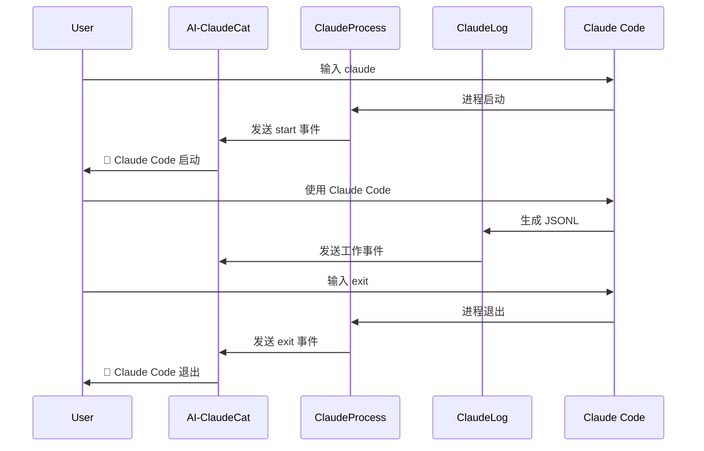

# 🔍 Claude Code 进程监控功能

**版本**: v4.1.2+  
**状态**: 🧪 实验性功能  
**最后更新**: 2026-02-06

---

## 📋 概述

进程监控功能可以检测 Claude Code 应用程序的启动和退出，补充了原有日志监控的不足。

### 🎯 解决的问题

**原有方案的限制**:
- ❌ 无法检测 `claude` 命令执行
- ❌ 无法检测 `exit` 退出命令
- ❌ 只能监控会话内部活动

**新方案的优势**:
- ✅ 直接检测进程生命周期
- ✅ 实时响应启动/退出
- ✅ 与日志监控完美互补

---

## 🛠️ 技术实现

### **核心组件**

| 组件 | 文件 | 功能 |
|------|------|------|
| **ProcessMonitor** | `src/utils/process_monitor.py` | 进程检测逻辑 |
| **ClaudeProcessPlugin** | `src/plugins/claude_process.py` | 插件接口封装 |
| **配置** | `config.json` | 启用和配置 |

### **检测机制**

```python
# 进程识别条件
def _is_claude_process(self, proc) -> bool:
    name = proc.info.get('name', '').lower()
    cmdline = proc.info.get('cmdline', [])
    
    # 1. 进程名检查
    if name in ['claude', 'claude.exe']:
        return True
    
    # 2. 命令行参数检查
    if cmdline and any('claude' in str(arg).lower() for arg in cmdline):
        return True
    
    return False
```

---

## 🚀 使用方法

### **1. 启用进程监控**

编辑 `config.json`:

```json
{
  "plugins": {
    "claude_log": {
      "enabled": true,
      "check_interval": 0.5,
      "priority": 10
    },
    "claude_process": {
      "enabled": true,        // 👈 启用进程监控
      "check_interval": 1.0,   // 👈 检查间隔（秒）
      "priority": 1            // 👈 优先级（1=最高）
    }
  }
}
```

### **2. 运行测试**

```bash
# 测试进程监控
python test_process_monitor.py

# 或者运行主程序
python main.py
```

### **3. 测试步骤**

1. **启动 AI-ClaudeCat**:
   ```bash
   python main.py
   ```

2. **在另一个终端启动 Claude Code**:
   ```bash
   claude
   ```

3. **观察输出**:
   ```
   [claude_process] 🚀 Claude Code 启动 (PID: 12345)
   ```

4. **在 Claude Code 中退出**:
   ```bash
   (在 Claude Code 中输入) exit
   ```

5. **观察输出**:
   ```
   [claude_process] 🛑 Claude Code 退出 (PID: 12345)
   ```

---

## 📊 事件输出

### **启动事件**
```json
{
  "status": "running",
  "confidence": 0.95,
  "details": {
    "event": "process_start",
    "pid": 12345,
    "command_line": "/usr/local/bin/claude",
    "timestamp": 1754523456.789,
    "message": "Claude Code 进程启动 (PID: 12345)"
  }
}
```

### **退出事件**
```json
{
  "status": "stopped",
  "confidence": 0.95,
  "details": {
    "event": "process_exit",
    "pid": 12345,
    "timestamp": 1754523510.123,
    "message": "Claude Code 进程退出 (PID: 12345)"
  }
}
```

### **全部退出事件**
```json
{
  "status": "idle",
  "confidence": 0.95,
  "details": {
    "event": "all_processes_exited",
    "message": "所有 Claude Code 进程已退出"
  }
}
```

---

## 🔄 工作流程



---

## ⚙️ 配置参数

| 参数 | 类型 | 默认值 | 说明 |
|------|------|--------|------|
| `enabled` | boolean | `false` | 是否启用进程监控 |
| `check_interval` | number | `1.0` | 检查间隔（秒） |
| `priority` | number | `1` | 插件优先级（越小越高） |

---

## 🎯 优势和限制

### **✅ 优势**

1. **直接检测** - 监控进程本身，不依赖日志
2. **实时响应** - 1秒内检测到启动/退出
3. **跨平台** - Windows、macOS、Linux 通用
4. **多进程支持** - 同时监控多个 Claude Code 实例
5. **低误报** - 进程名+命令行双重验证

### **⚠️ 限制**

1. **CPU 占用** - 1秒轮询（可配置间隔）
2. **权限要求** - 需要读取进程信息的权限
3. **依赖库** - 需要 `psutil`（已包含在 requirements.txt）

---

## 🔧 故障排除

### **问题 1: 无法检测启动**

**可能原因**:
- Claude Code 路径不在 PATH 中
- 权限不足
- 检查间隔太长

**解决方案**:
```bash
# 检查 Claude 安装
which claude
claude --version

# 降低检查间隔
"check_interval": 0.5
```

### **问题 2: 误报其他进程**

**可能原因**:
- 进程名冲突
- 命令行匹配过宽

**解决方案**:
- 查看检测到的进程信息
- 调整 `_is_claude_process` 逻辑

### **问题 3: 性能影响**

**解决方案**:
```json
{
  "claude_process": {
    "check_interval": 2.0  // 增加到 2 秒
  }
}
```

---

## 🧪 测试

### **自动化测试**
```bash
python test_process_monitor.py
```

### **手动测试**
1. 启动 AI-ClaudeCat
2. 启动/退出 Claude Code 多次
3. 观察 WebSocket/HTTP 输出
4. 检查 SQLite 历史记录

---

## 📈 未来改进

### **计划功能**
- 🎯 **配置化检测规则** - 用户自定义进程匹配
- 🔍 **进程详细信息** - CPU、内存使用情况
- 📊 **启动统计** - 记录启动次数和时长
- 🌐 **远程监控** - 监控网络连接的 Claude Code

### **性能优化**
- ⚡ **事件驱动** - 使用系统事件而非轮询
- 🔋 **智能调节** - 根据活动调整检查频率
- 📱 **移动端支持** - 适配移动端 Claude Code

---

## 📚 相关文档

- [工具命名分析](./TOOL-NAMING-ANALYSIS.md) - 27 种工具详解
- [配置说明](../CONFIG.md) - 完整配置文档
- [插件开发](../CLAUDE.md#插件开发) - 自定义插件开发

---

**状态**: 🧪 实验性功能 - 欢迎反馈和改进建议！